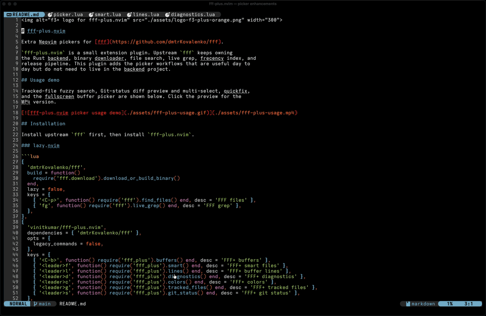

# fff-plus.nvim

Extra Neovim pickers for [fff](https://github.com/dmtrKovalenko/fff).

`fff-plus.nvim` is a small extension plugin. Upstream `fff` keeps owning
the Rust backend, binary downloader, file search, live grep, frecency index, and
release pipeline. This plugin adds the picker workflows that are useful day to
day but do not need to live in the backend project.

## Usage demo

Tracked-file fuzzy search, Git-status diff preview and multi-select, quickfix,
and the fullscreen buffer picker are shown below. Click the preview for the
MP4 version.

[](./assets/fff-plus-usage.mp4)

## Installation

Install upstream `fff` first, then install `fff-plus.nvim`.

### lazy.nvim

```lua
{
  'dmtrKovalenko/fff',
  build = function()
    require('fff.download').download_or_build_binary()
  end,
  lazy = false,
  keys = {
    { '<C-p>', function() require('fff').find_files() end, desc = 'FFF files' },
    { 'fg', function() require('fff').live_grep() end, desc = 'FFF grep' },
  },
},
{
  'vinitkumar/fff-plus.nvim',
  dependencies = { 'dmtrKovalenko/fff' },
  opts = {
    legacy_commands = false,
  },
  keys = {
    { '<C-b>', function() require('fff_plus').buffers() end, desc = 'FFF+ buffers' },
    { '<leader>f', function() require('fff_plus').smart() end, desc = 'FFF+ smart files' },
    { '<leader>l', function() require('fff_plus').lines() end, desc = 'FFF+ buffer lines' },
    { '<leader>d', function() require('fff_plus').diagnostics() end, desc = 'FFF+ diagnostics' },
    { '<leader>c', function() require('fff_plus').colors() end, desc = 'FFF+ colors' },
    { '<leader>g', function() require('fff_plus').tracked_files() end, desc = 'FFF+ tracked files' },
    { '<leader>s', function() require('fff_plus').git_status() end, desc = 'FFF+ git status' },
  },
}
```

### vim.pack

```lua
vim.pack.add({
  'https://github.com/dmtrKovalenko/fff',
  'https://github.com/vinitkumar/fff-plus.nvim',
})

vim.api.nvim_create_autocmd('PackChanged', {
  callback = function(ev)
    local name, kind = ev.data.spec.name, ev.data.kind
    if name == 'fff' and (kind == 'install' or kind == 'update') then
      if not ev.data.active then vim.cmd.packadd('fff') end
      require('fff.download').download_or_build_binary()
    end
  end,
})

require('fff_plus').setup({
  legacy_commands = false,
})
```

## Pickers

| API | Command | What it does |
| --- | --- | --- |
| `require('fff_plus').buffers()` | `:FFFPlusBuffers` | Switch between listed buffers, preview contents, and delete buffers |
| `require('fff_plus').colors()` | `:FFFPlusColors` | Browse colorschemes with live preview and restore on cancel |
| `require('fff_plus').tracked_files()` | `:FFFPlusGitFiles` | Browse files tracked by Git |
| `require('fff_plus').git_status()` | `:FFFPlusGitStatus` | Browse changed files with status indicators and diff preview |
| `require('fff_plus').git_files()` | `:FFFPlusGFiles` | Compatibility API for the Git-status picker |
| `require('fff_plus').smart()` | `:FFFPlusSmart` | Combine buffers, recent files, and upstream indexed files; deduplicate and frecency-rank them |
| `require('fff_plus').lines()` | `:FFFPlusLines` | Browse nonblank lines in the current buffer |
| `require('fff_plus').loaded_lines()` | `:FFFPlusLoadedLines` | Browse nonblank lines in loaded, listed buffers |
| `require('fff_plus').diagnostics()` | `:FFFPlusDiagnostics` | Browse workspace diagnostics, ordered by severity and location |
| `require('fff_plus').buffer_diagnostics()` | `:FFFPlusBufferDiagnostics` | Browse diagnostics in the current buffer |
| `require('fff_plus').resume()` | `:FFFPlusResume` | Resume the most recently closed FFF+ picker and query |

All pickers support smart-case ranked matching, query history, resume, help,
selection, responsive layouts, and matched-character highlighting. Add `!` to
an extension command to use the fullscreen layout, for example
`:FFFPlusBuffers!`.

### Queries

Space-separated terms are combined. Lowercase terms are case-insensitive;
terms containing uppercase letters preserve case.

| Query | Meaning |
| --- | --- |
| `fpm` | Fuzzy subsequence match |
| `'picker` | Exact contiguous match |
| `^lua` | Prefix match |
| `.lua$` | Suffix match |
| `picker !test` | Match `picker`, excluding results matching `test` |
| `kind:buffer init` | Match a source-specific field plus a text term |

Smart supports `kind:`, `source:`, and `path:` fields. Lines supports
`buffer:`, `path:`, and `line:`. Diagnostics supports `severity:`, `source:`,
`code:`, and `path:`.

### Actions

Shared picker controls:

| Action | Default key |
| --- | --- |
| Move up / down | `<C-p>` / `<C-n>` |
| Open / split / vertical split / tab | `<CR>` / `<C-s>` / `<C-v>` / `<C-t>` |
| Toggle selection | `<Tab>` |
| Select all filtered results | `<C-a>` |
| Previous / next query | `<C-Up>` / `<C-Down>` |
| Refresh | `<F5>` |
| Toggle available preview / maximize | `<C-/>` / `<C-g>m` |
| Focus input / list / preview | `<C-g>i` / `<C-g>l` / `<C-g>p` |
| Show key help | `<F1>` |

Buffers, Git files, Smart, Lines, and Diagnostics also support:

| Action | Default key |
| --- | --- |
| Send selected/current entries to quickfix | `<C-q>` |
| Send selected/current entries to location list | `<C-g>q` |

Buffers, Git files, and Smart also support:

| Action | Default key |
| --- | --- |
| Paste selected/current paths into the invoking buffer | `<A-CR>` |

Git status mutations run asynchronously. Restore always asks for confirmation:

| Action | Default key |
| --- | --- |
| Stage selected/current files | `<A-s>` |
| Unstage selected/current files | `<A-u>` |
| Restore selected/current worktree files | `<A-r>` |

Override the paste key per call, or make the buffer picker jump to a window
that already displays the selected buffer:

```lua
require('fff_plus').buffers({
  jump_to_existing = true,
  keymaps = { paste = '<M-p>' },
})
```

Preview can be placed on any side and automatically disappears when the frame
is too narrow or short. Every option can also be passed to an individual picker:

```lua
require('fff_plus').smart({
  layout = {
    preview_position = 'left', -- left, right, top, or bottom
    preview_size = 0.4,
    preview_min_width = 70,
  },
})
```

## Compatibility Aliases

Set `legacy_commands = true` to also register aliases for muscle memory from
fzf.vim-style workflows:

```lua
require('fff_plus').setup({
  legacy_commands = true,
})
```

That enables:

- `:FFFBuffers`
- `:Colors`
- `:GFiles` (tracked files, matching fzf.vim semantics)

The older `:FFFPlusGFiles` command and `git_files()` Lua API remain aliases for
the Git-status workflow. Prefer the explicit `FFFPlusGitFiles`/
`tracked_files()` and `FFFPlusGitStatus`/`git_status()` names in new config.

If you want old Lua call sites such as `require('fff').buffers()` to continue
working, add a tiny shim in your config:

```lua
local plus = require('fff_plus')
local fff = require('fff')

fff.buffers = plus.buffers
fff.colors = plus.colors
fff.git_files = plus.git_files
fff.git_status = plus.git_status
fff.tracked_files = plus.tracked_files
```

## Maintenance Notes

This repo intentionally does not carry upstream backend code. That keeps the
sync burden low, but these pickers still reuse upstream Lua internals:

- `fff.conf`
- `fff.file_picker.preview`
- `fff.file_picker.icons`
- `fff.highlights`

Smart uses upstream's public `fff.file_search()` API for indexed and frecency
ranked results. Git commands and diff previews use `vim.system` argv arrays and
are cancelled when superseded or when the picker closes.

If upstream refactors those modules, `fff-plus.nvim` may need a compatibility
update. The long-term ideal is a small public picker-extension API in upstream
`fff.nvim`.

See [EXPERIMENT_EXTENSION_PLUGIN.md](./EXPERIMENT_EXTENSION_PLUGIN.md) for the
full tradeoff notes.
